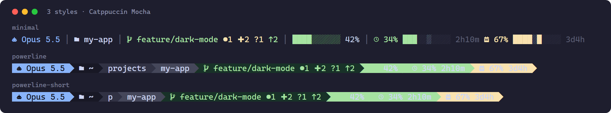
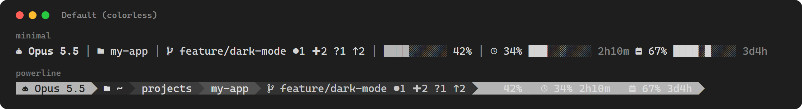
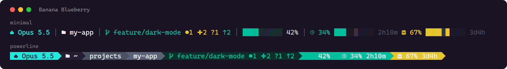
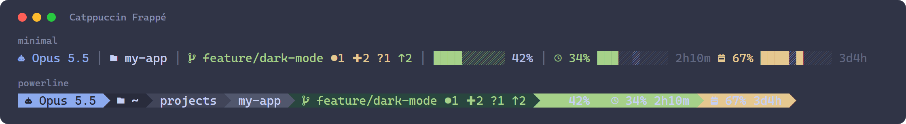
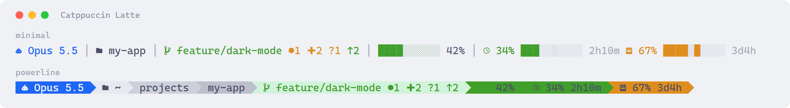
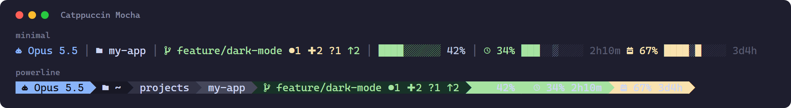

# Claude Statusline

A compact, color-coded status bar for [Claude Code](https://claude.ai/code): model, working
directory, git branch and working-tree state, context window usage, and your 5-hour and 7-day
rate limits — in one line, updated every few seconds.



## Features

- **3 display styles:** `minimal`, `powerline`, `powerline-short`
- **6 color schemes:** Default (colorless), Banana Blueberry, Catppuccin Frappé, Catppuccin Latte, Catppuccin Macchiato, Catppuccin Mocha
- **Rate limits at a glance:** 5-hour session and 7-day weekly usage, with a fill bar, an elapsed-time marker and a reset countdown
- **Git state:** branch plus staged / modified / untracked counts and ahead / behind upstream
- **One file, no dependencies:** a single Python 3 script using only the standard library
- **`/statusline` skill** to switch style, scheme and rate-limit visibility from inside Claude Code

## What the segments show

From left to right:

| Segment | Shows |
|---------|-------|
| Model | The model of the current session, e.g. `Opus 5.5` |
| Directory | The working directory — just its name in `minimal`, the full path in `powerline`, the full path with abbreviated parent folders in `powerline-short` |
| Git | Current branch, then only the counters that are non-zero: `●` staged, `✚` modified, `?` untracked, `↑` commits ahead of and `↓` behind upstream. Hidden outside a git repository |
| Context | How full the context window is |
| 5-hour limit | Usage of the rolling 5-hour session limit and the time until it resets |
| 7-day limit | Usage of the weekly limit and the time until it resets |

**Colors.** The context and rate-limit segments change color with usage: normal below 60%,
warning from 60%, critical from 80%.

**Reading the rate-limit bars** (`minimal` style). The solid fill (`█`) is how much of the limit
you have used. The lighter `░` block is where you are in time within that window — at the
halfway point of a 5-hour window it sits in the middle of the bar. If the fill runs ahead of the
marker, you are using the limit faster than the window elapses and will hit it before it
resets. The `powerline` styles show the percentage and the countdown without the bar.

Rate limits only appear when Claude Code sends them, which it does for Claude subscription
logins; with an API key the two rate-limit segments stay hidden. A window at 0% is hidden too.

## Styles & color schemes

The screenshot above shows the three styles. Every scheme works with every style:

<details>
<summary><b>Show all 6 color schemes</b></summary>








</details>

`catppuccin-latte` is the light scheme; the others are made for dark terminal backgrounds.

## Install

### Prerequisites

- [Claude Code](https://claude.ai/code)
- Python 3.9 or later
- A [Nerd Font](https://www.nerdfonts.com/) (v3 or later) set as your terminal font — without
  one, the icons and powerline arrows render as empty boxes
- Git on `PATH` — optional; without it the git segment is simply hidden

### 1. Get the script

**Option A — clone the repository** (recommended: you also get the `/statusline` skill):

```bash
git clone https://github.com/speti4/claude-statusline.git
cd claude-statusline
```

then copy the script to `~/.claude/` with the deploy script for your platform:

```bash
bash scripts/deploy.sh          # macOS / Linux
```
```powershell
pwsh scripts/deploy.ps1         # Windows (PowerShell 7+)
```

**Option B — download only the script:**

```bash
curl -fsSL https://raw.githubusercontent.com/speti4/claude-statusline/main/statusline.py -o ~/.claude/statusline.py
```
```powershell
Invoke-WebRequest https://raw.githubusercontent.com/speti4/claude-statusline/main/statusline.py -OutFile "$HOME\.claude\statusline.py"
```

### 2. Enable it in Claude Code

Add this block to `~/.claude/settings.json`:

```json
"statusLine": {
  "type": "command",
  "command": "python ~/.claude/statusline.py",
  "padding": 1,
  "refreshInterval": 5
}
```

On macOS and Linux use `python3` instead of `python`. `refreshInterval` (seconds) keeps the
countdowns and time markers moving while the session is idle.

## Configure

**With the `/statusline` skill** — from a Claude Code session opened in the cloned repository:

```
/statusline                      # show the options and the current settings
/statusline powerline            # style: minimal | powerline | powerline-short
/statusline catppuccin-latte     # scheme: default | banana-blueberry | catppuccin-frappe
                                 #         catppuccin-latte | catppuccin-macchiato | catppuccin-mocha
/statusline rate-5h              # rate limits: rate-all | rate-5h | rate-7d | rate-none
/statusline powerline rate-none  # several at once
```

The change shows up in the status bar right away.

**By hand** — edit the three settings at the top of `~/.claude/statusline.py`:

```python
STYLE = "minimal"
COLOR_SCHEME = "catppuccin-mocha"
SHOW_RATE_LIMITS = "all"
```

These three values above are the defaults the script ships with.

### Updating

- **Option A:** `git pull`, then run the deploy script again. Your settings live in
  `statusline.py` itself, and `/statusline` writes them into the repository copy too, so if
  `git pull` refuses because of local changes, run `git stash`, `git pull`, `git stash pop`.
- **Option B:** download the script again and re-apply your three settings.

See [CHANGELOG.md](CHANGELOG.md) for what changed in each release.

## Troubleshooting

**Icons show up as empty boxes or question marks.** Your terminal is not using a Nerd Font.
Install one (v3 or later) and select it in the terminal's font settings.

**The status bar stays empty.** Run the script by hand with a sample payload, using the same
command as in `settings.json`:

```bash
echo '{"model":{"display_name":"Test"},"workspace":{"current_dir":"."},"context_window":{"used_percentage":42}}' | python ~/.claude/statusline.py
```

It should print one line. A "command not found" error means the Python command is wrong for your
system (`python` vs `python3`).

**No rate-limit segments.** Expected with an API key or right after a limit resets to 0% — see
[What the segments show](#what-the-segments-show). Also check that `SHOW_RATE_LIMITS` is not
`"none"`.

**No git segment.** The working directory is not inside a git repository, or `git` is not on
`PATH`.

## Usage snapshot

On every refresh the script also writes `~/.claude/usage-snapshot.json` — model, context usage
and both rate limits with their reset times — so other tools (a dashboard, a tray widget) can
read your current usage without talking to Claude Code.

## Development

### Files

| File | Purpose |
|------|---------|
| `statusline.py` | The statusline script |
| `.claude/skills/statusline/` | `/statusline` skill (`SKILL.md` + `set_style.py`), project-level |
| `.claude/skills/deploy/SKILL.md` | `/deploy` skill — runs the deploy script for your platform |
| `scripts/deploy.ps1`, `scripts/deploy.sh` | Copy `statusline.py` to `~/.claude/` (Windows / macOS, Linux) |
| `docs/images/` | README screenshots |
| `CHANGELOG.md` | Release notes, one section per version |

After editing `statusline.py`, run the deploy script (or the `/deploy` skill from a session in
this repo) to update the copy Claude Code runs.

### Dumping the raw stdin payload

Claude Code documents only part of what it sends the statusline, so when a question comes
up about a field, dump the payload instead of guessing. Set `CLAUDE_STATUSLINE_DUMP` to a
directory (or to `1` for `~/.claude/statusline-dump/`) and each invocation appends its
stdin verbatim as one JSON line:

```powershell
$env:CLAUDE_STATUSLINE_DUMP = "1"; claude    # PowerShell
```
```bash
CLAUDE_STATUSLINE_DUMP=1 claude              # bash / zsh
```

Two constraints: Claude Code reads the variable when it starts, so it has to be set
**before** launching a session — an already-running one never dumps. And each session
writes its own `stdin-<pid>.jsonl`, because concurrent appends to a single file
interleave into unparseable lines. Each file stops growing at 20 MB.

### Where development happens

This repository is the published, user-facing copy. Development, task tracking and
internal notes live in a separate private repository, and every release is synced here by
a GitHub Action, tagged with the version from `statusline.py` and described in
`CHANGELOG.md`. Issues and suggestions are welcome here.

## License

[MIT](LICENSE)
